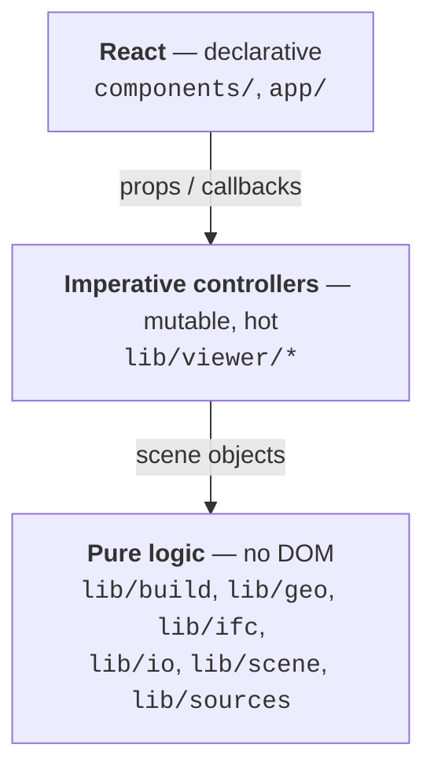
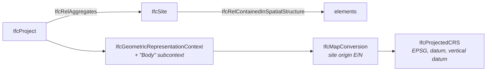
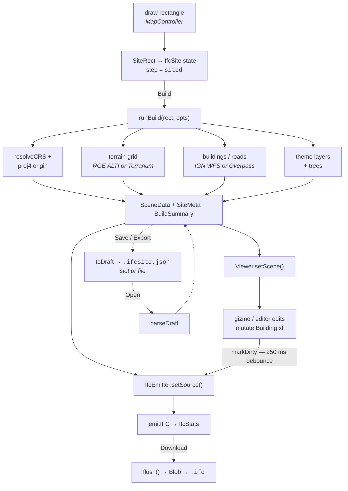

# IFC Site — Developer Guide

> Looking for how to run it, what it does and what comes out of it?
> That is [README.md](README.md). This file is the internals.

**IFC Site** is a browser-only tool that turns a rectangle drawn on a map into a
georeferenced **IFC** file of the buildings, roads, terrain and context layers inside it,
in IFC2X3, IFC4 or IFC4X3.

There is no backend. `next build` emits a static site (`output: 'export'`), and every
request — Overpass, IGN Géoplateforme, Nominatim, Terrarium DEM — goes straight from the
browser to a service that sends `Access-Control-Allow-Origin: *`. The whole pipeline
(projection, geometry, IFC serialisation, download) runs in the tab.

> **Serve `out/` over HTTP.** Opening `out/index.html` via `file://` gives the page a null
> origin, which Overpass rejects — the result is an empty response rather than an error,
> which is far harder to diagnose. See [next.config.ts](next.config.ts).

---

## 1. Stack and tooling

| Concern | Choice |
| --- | --- |
| Framework | Next.js 16 (App Router), static export, Turbopack |
| UI | React 19, Tailwind CSS 4, shadcn (`base-nova` style) over `@base-ui/react` primitives |
| 3D | three.js 0.160 — `OrbitControls`, `TransformControls`, `InstancedMesh`, a custom sky shader |
| 2D map | Leaflet 1.9 over OSM raster tiles |
| Projection | proj4 |
| IFC | hand-written ISO-10303-21 serialiser, IFC2X3 / IFC4 / IFC4X3 — no IFC library |
| Types | TypeScript 7 in `strict` mode; type checking routed through the TS CLI (`experimental.useTypeScriptCli`) |

Scripts (`package.json`):

```
npm run dev        next dev
npm run build      next build  →  out/
npm run start      npx serve out
npm run typecheck  tsc --noEmit
```

Path alias `@/*` maps to the repo root.

---

## 2. Directory map

```
app/                 Next.js shell — layout, page, all CSS
components/          React UI (the "what to do" layer)
  ui/                shadcn primitives over @base-ui/react
lib/
  build/             the fetch-and-build orchestration + IFC emitter lifecycle
  geo/               pure geometry: CRS, rings, meshes, rectangles, Euler decomposition
  i18n/              FR/EN dictionaries, key vocabulary, React context
  ifc/               SPF serialiser (three schemas) and the scene → IFC pass
  io/                the draft document: snapshot, IndexedDB slots, download/read
  scene/             scene-record construction, layer table, per-element transform
  sources/           network adapters: Overpass, IGN, Nominatim, Terrarium
  theme/             light/dark context — the single writer of the `dark` class
  ui/                the derived flow step and the cooperative-yield helper
  viewer/            imperative three.js Viewer and Leaflet MapController
public/
  assets/Tree.glb    the tree instance the viewer clones
  epsg.json          generated CRS index — `npm run epsg`, committed, see §9
scripts/
  build-epsg.ts      generates the above from the epsg-index package
context_48.8566_2.3522.ifc       a sample export
```

---

## 3. Architecture at a glance

Three layers, with a strict rule between them:



**Nothing below the React layer builds a user-facing sentence.** The pure logic and the
controllers emit an i18n *key* plus a params bag ([lib/i18n/keys.ts](lib/i18n/keys.ts)),
and React looks it up in the active dictionary. That is what lets the language toggle
re-translate a status line that is already on screen, and why every thrown failure is an
`AppError` carrying a code rather than an English `message`.

The other structural rule: **React never owns the scene.** A build can produce thousands
of buildings, each with its own ring, and the viewer mutates those records in place during
a gizmo drag. React only sees derived numbers (counts, stats) and a *clone* of the selected
element's transform.

---

## 4. The application shell

### [app/layout.tsx](app/layout.tsx)
Loads IBM Plex Sans/Mono as CSS variables and sets static metadata in the default language
(`fr`). `LangProvider` rewrites `<html lang>`, `document.title` and the description meta
client-side once the stored/URL preference is known — the page is prerendered at build
time, so reading `localStorage` during render would be a hydration mismatch.

Also carries the **no-flash theme script**, inlined in `<head>` so it runs before the first
paint. The app is a static export: the HTML on disk has no theme on it, so without this a
visitor who has chosen dark gets a white flash for as long as the bundle takes to load. It
duplicates the resolution in [lib/theme/context.tsx](lib/theme/context.tsx) — a stored
override, otherwise light — and **the two have to stay in step**, or the first frame and
the first render disagree. `suppressHydrationWarning` on `<html>` is for the class and
`color-scheme` it writes.

### [app/page.tsx](app/page.tsx)
Just `<ThemeProvider><LangProvider><IfcSite /></LangProvider></ThemeProvider>`. Both sit
*above* everything so switching language or theme never remounts the WebGL canvas or the
Leaflet map — both are imperative and would lose camera, selection and undo stack.

### [app/globals.css](app/globals.css) (~1300 lines)
Tailwind 4 with `@theme` tokens (the ink/yellow/paper palette), shadcn's semantic tokens
retuned to it, and a `@layer components` block holding the hand-written chrome: the
floating dock, status bar, site readout, status toast, element editor, info overlay,
Leaflet overrides and the narrow-viewport rules. Layout is one full-bleed viewer with
everything else floating over it on a grid, so panels can never cover one another and the
gaps stay transparent to map/orbit gestures.

**Theming** is one `html.dark { … }` block that re-declares the palette. The `@theme` block
is deliberately left non-inline: that makes Tailwind emit `--color-ink` and friends into
`:root` *and* compile `bg-ink`/`text-ink` to `var(--color-ink)`, so re-declaring the same
names under `html.dark` re-tints the utilities and the hand-written component layer in one
move. Switching it to `@theme inline` would stop those custom properties being emitted and
every `var(--color-ink)` in the file would resolve to nothing.

Two consequences worth knowing before editing colours:

- **Pairing tokens.** `--color-ink` inverts, so `background: ink; color: yellow` would come
  out yellow-on-white in the dark theme. Anything painted *on* another colour uses
  `--color-on-ink` / `--color-on-yellow` / `--color-on-err` instead of naming a hue.
  `--color-on-yellow` is dark in both themes — the accent is the same yellow either way.
- **Surfaces** (`--color-surface`, `--color-surface-solid`, `--color-scrim`,
  `--color-shadow`, `--color-basemap`, `--color-hairline`, `--color-code`) were extracted
  from literals that had nothing to override. Do not reintroduce a raw `#fff`.

[lang-toggle.tsx](components/lang-toggle.tsx) holds its colours as Tailwind classes rather
than in this file (they have to displace shadcn's own utilities), so it writes them as
arbitrary values off the same custom properties — not as `bg-white` plus a `dark:` variant,
which would be a second source of truth for the flip.

---

## 5. The React layer (`components/`)

### [ifc-site.tsx](components/ifc-site.tsx) — the orchestrator (393 lines)
The single stateful component. It owns:

- **Imperative refs** (deliberately outside React): the `Viewer`, the `MapController`, the
  `IfcEmitter` (which holds the live scene the viewer mutates), the `SiteMeta`, a deferred
  map action, and a mirror of `infoOpen` for the mount-only key handler.
- **React state**: build form, site rectangle, armed/busy flags, view tab, status, stats,
  selection snapshot, undo/redo availability, gizmo mode, dock/info visibility, and
  `siteDirty` (the rectangle moved since the last build, so the scene — and the IFC behind
  Download — no longer describes it).
- **`unsavedRef`** (a ref, since nothing renders from it): what is on screen exists nowhere
  on disk — never saved, or edited since it was. A different question from `siteDirty`,
  which is about the rectangle, and from `draftNameRef`, which is only a name and survives
  the edits made after the save that set it. Raised by `touch()` — the one call that
  replaced every bare `markDirty()`, so an edit cannot mark the IFC text stale without
  also marking the last save stale — and by a build, which produces a document no draft
  describes. Lowered by Save, Export draft and Open. `useUnloadGuard`
  ([lib/ui/unload-guard.ts](lib/ui/unload-guard.ts)) reads it from a `beforeunload`
  listener armed on `hasScene`, so a refresh or a closed tab asks before discarding the
  work. Download does not lower it: an `.ifc` is the deliverable and does not reopen here.
- **Two mount effects** that construct the `Viewer` and the `MapController` and wire their
  callbacks back into `setState`. The map arms drawing immediately: drawing is the first
  thing anyone does here.
- **`runOnMap`** — Leaflet measures its container, and a tab switch is a state change that
  has not committed yet when the handler runs. Anything that moves the map is queued until
  the map is actually laid out; `fitBounds` against a `display:none` container frames
  against zero size.
- **Global keyboard**: `Ctrl/Cmd+Z / Y / Shift+Z` for undo/redo (deferring to native undo
  inside text fields), `G/R/S` for translate/rotate/scale, `D` to duplicate the selected
  buildings and trees, `Del` to remove them, and `Escape` unwinding outermost-first — info
  card, then a drawing gesture, then the 3D selection. All three act on the whole selection,
  which is what makes them one undo step over however many elements.
- **Provider coupling**: switching to IGN forces EPSG:2154 (Lambert-93, the datum IGN
  publishes in); switching away clears the IGN-only layers, which have no OSM equivalent.
- **CRS follows the site.** Each new rectangle selects the best system for where it landed
  (`bestAt`), until the field is used by hand — after that the choice is the user's, and a
  rectangle nudged fifty metres must not overrule it. Changing the CRS with a scene up also
  raises `siteDirty`: reprojecting moves every coordinate in the file, so what is on screen
  no longer describes what Download would write.
- **`onBuild`** calls `runBuild`, then feeds the result to the emitter and the viewer and
  flips to the 3D tab. **`onDownload`** flushes the emitter's debounce window and triggers
  a Blob download named `IFCSITE_<lon>_<lat>.ifc` — longitude first, matching the
  east-then-north order the georeferencing is written in. The name is a pure function of
  where the site is, so re-exporting the same site overwrites rather than accumulating
  numbered copies in the downloads folder.
- **Theme push.** Both viewers own a backdrop CSS cannot reach — a shader dome and a tile
  URL — so the class on `<html>` is not enough for either. An effect on `theme` calls
  `Viewer.setTheme` and `MapController.setTheme`; both return early when the theme has not
  moved. The map is constructed from a promise (Leaflet is imported dynamically), so it
  reads the theme off `themeRef` when it lands rather than relying on that effect, which
  has usually already run against a null ref.

### The bottom of the window, split three ways

There was one full-width status bar holding four unrelated jobs. They are separated by how
long each is true for, which is what let two of the three stop being permanent chrome:

| Component | Lifetime |
| --- | --- |
| [status-bar.tsx](components/status-bar.tsx) | The two actions, plus the height field while a draw tool is armed, plus the wrench chip beside Download that opens `ifc-flyout`. Shrink-wrapped and centred on the window (`grid-column: 1 / -1; justify-self: center`, so the element editor opening does not slide it). **Not a `.floating` surface**, unlike every other cluster on the overlay: two buttons in a bordered tray read as one toolbar where these are two separate ends to the sequence, so the row is bare and each button carries its own square outline and shadow (`.statusbar .btn-*`). Returns `null` when it would be empty. |
| [site-readout.tsx](components/site-readout.tsx) | Standing facts: site size, buildings, entities, file size, origin. Bottom-right corner of the same grid row as the bar, as text rather than a panel, with `pointer-events: none` — a corner of the map that cannot be dragged because a number is lying on it is a worse trade than the number. Off by default; the stats toggle in the utility chip shows it. Hidden with `visibility`, not unmounted, so its row keeps its height and the flyouts and element editor above it do not resize on toggle. |
| [status-toast.tsx](components/status-toast.tsx) | What just happened. Floats over the stage above the bar and fades on its own. |

The toast holds two lifetimes of its own, and the distinction is the design: the **draw
hint** and the **stale-scene warning** are conditions, not events — they are true for
exactly as long as a tool is armed or the rectangle is ahead of the scene, so they pin and
never time out. Everything routed through `setStatus` is transient: 5 s for a message, 9 s
for a build summary, and **errors do not fade at all** (they wait to be superseded or
dismissed — a failure that erases itself before it is read is worse than one that lingers).

Three things there are easy to break:

- The live region is **mounted for the life of the app** and emptied rather than unmounted.
  A `role="status"` element that appears at the same moment as its text is announced
  unreliably.
- The toast is keyed on the `status` **object**, not its contents. `setStatus` always builds
  a fresh literal, so the same message twice still restarts the timer — which is what keeps
  the toast up across a build's run of progress lines.
- `status.ready` is the boot state, not news; the first effect run is skipped or the page
  opens with a toast already fading.

`draw → sited → busy → ready` is derived, not stored, and now lives in
[lib/ui/step.ts](lib/ui/step.ts) because the bar and the toast both branch on it and have to
agree — the bar offers Rebuild in the same step the toast calls the scene stale.

### Panels

| Component | Role |
| --- | --- |
| [stage.tsx](components/stage.tsx) | The two viewer hosts. Both stay mounted; the map is an overlay toggled with `display`, never unmounted. `StageHud` holds the compass (also permanently mounted — the viewer is handed the element once, on mount) plus the legend and hint. |
| [brand-chip.tsx](components/brand-chip.tsx) | What is left of the masthead: the wordmark and the Map/3D switch, shrink-wrapped into the top-left corner. It used to be a strip across the whole window carrying a readout and three utility buttons as well — a bar between the user and the viewer for the sake of two controls. The readout moved to the status bar and the utilities to the opposite corner. |
| [util-chip.tsx](components/util-chip.tsx) | The opposite corner: compass host, origin-marker toggle, orthographic toggle, presentation mode, stats toggle, theme toggle, info and the language select. Icon-only, so every label is a tooltip — and each is written as *what pressing it does*, not as the state it is in. |
| [tool-rail.tsx](components/tool-rail.tsx) | The vertical rail: pan/select, draw site, zoom to site, the box/polygon/tree draw tools, the two measure tools, the three gizmo modes and Duplicate, undo/redo, and the four flyout buttons (search, options, model tree, drafts). Icon-only and stateless — every button is a callback into `ifc-site`, and what is *offered* is derived from `view`, `hasScene`, `rect` and `selection` rather than stored. |
| [controls-panel.tsx](components/controls-panel.tsx) | The options flyout: site extent readout, the CRS field, vertical datum, default-height slider, provider select, terrain accuracy, and the include checkboxes. IGN-only layers are dimmed and inert under OSM. Below them an **Advanced** disclosure, collapsed on every open (the panel unmounts with the flyout, so its local `useState(false)` is the default rather than something that has to be reset), holding the nine pipeline tunables in three sub-sections, plus a **Drape onto terrain** group of five per-layer checkboxes (IGN-only, dimmed under OSM, since OSM ways are 2D and there would be nothing to fall back to). Every tunable is a bounded `Slider` — these numbers feed fetch deadlines and geometry loops, where a bad one is a wedged tab rather than a wrong pixel, and a slider cannot emit an out-of-range or non-finite value. **Holds no actions** — settings only. |
| [crs-field.tsx](components/crs-field.tsx) | The projected CRS, as a searchable list of the systems valid where the site actually is. It carries its own loading rather than sitting in the dock, because the list is a function of a rectangle drawn on the other side of the app — and it is inert until there is one, since a CRS list has nothing to be evaluated against and any choice made early is one the first rectangle invalidates. The hint line doubles as the loading and failure channel. |
| [search-flyout.tsx](components/search-flyout.tsx) | The place search on its own rail button rather than folded into Options — finding a place is the first thing you do, before there is anything to configure. It opens on arrival while no rectangle exists and collapses to an icon the moment one does. |
| [ifc-flyout.tsx](components/ifc-flyout.tsx) | What the exported file says about itself: the IFC schema, the names on `IfcProject` and `IfcSite`, and the author. The one flyout that is not the rail's — it opens *upward* off the wrench in the status bar, because it belongs to Download rather than to the build. None of it is a build input: a change is written into the live `SiteMeta` and the model on screen is re-serialised, the same route the origin marker's fields take. Blank means "leave the attribute out"; the two fields with a fallback instead show it as a placeholder. See `IfcMeta` in [lib/types.ts](lib/types.ts). |
| [file-flyout.tsx](components/file-flyout.tsx) | Drafts. Save into this browser, list/open/rename/delete the slots, open a dropped or picked `.ifcsite.json`, export one. **Save and Export are deliberately not synonyms** and the copy says so: Save keeps a site in this browser, Export writes a file you can move. Slot rows are sized and dated from `SlotMeta` alone (see §14) — `Intl.RelativeTimeFormat` in the *active* language, not the browser's. |
| [model-tree.tsx](components/model-tree.tsx) | The scene by layer: visibility, colour and a filter, with the leaves under each layer. **Windowed** — `ROW_H = 24` and ten visible rows, because a scene is capped at four thousand buildings and four thousand DOM rows is a panel that stutters on every expand. Keep `ROW_H` in step with `.treeItem` in [globals.css](app/globals.css); the row is a fixed height there for exactly this reason. Rows take the same Ctrl/Shift modifiers as a click in the 3D view, and highlight the whole selection rather than one row — which is the only way to reach an element buried inside another. |
| [element-editor.tsx](components/element-editor.tsx) | The selection panel, in four shapes depending on *what* is selected: an element (name, colour, opacity, height, X/Y/Z position/rotation/scale with a uniform-scale lock, reset, delete), a layer (colour, opacity and an offset applied to every element in it at once), the origin marker (its projected position, plus the local project placement — coordinates and angle, typed rather than dragged, and outside the undo history), or nothing. With several elements selected it keeps the element shape, showing the anchor's values under a `{n} elements` header; writing any field applies it to all of them. |
| [confirm-card.tsx](components/confirm-card.tsx) | A yes/no card for the one decision `Ctrl+Z` cannot take back: rebuilding or opening a draft over hand-drawn elements, which are not in any source and cannot be re-fetched. Not `window.confirm` — a native dialog is styled by the browser, sits outside the app's language, and cannot say how many buildings are about to go. It stacks above the info overlay because it is the only thing here that blocks. |
| [colour-field.tsx](components/colour-field.tsx) | The colour swatch, its own module because the element editor and the model tree both need it — and the live/commit split below is exactly the part that would go wrong if the second one were written again from scratch. |
| [status-line.tsx](components/status-line.tsx) | Renders a `StatusState` — a *key plus params*, a `BuildSummary`, or an error. The closing summary is composed from clauses here, not stored as one template, because the clauses order differently in French. |
| [place-search.tsx](components/place-search.tsx) | Debounced (500 ms) Nominatim search with a sequence guard against out-of-order responses, plus four city presets that also set the matching EPSG. Failure is reported and drawing keeps working. |
| [info-overlay.tsx](components/info-overlay.tsx) / [notes.tsx](components/notes.tsx) | The header prose and notes, behind the (i) button — full-bleed viewers left no room for prose, and none of it is needed to draw a rectangle. Note bodies mark code spans with backticks so prose stays a plain string in the dictionary — no `dangerouslySetInnerHTML`. The repo URL is the one string on this surface that does not translate, so it lives in the component. |
| [lang-toggle.tsx](components/lang-toggle.tsx) | FR/EN select. Flags are inline SVG, not emoji: Chrome and Edge on Windows render regional-indicator pairs as bare letter boxes. |
| [icons.tsx](components/icons.tsx) | Every icon in the rail and the tree, including `LAYER_ICON` — the one mapping from a `LayerId` to its glyph. |

Two input details worth knowing, both mirroring the original page's `oninput`/`onchange`
split — which is also the **undo boundary**:

- `AxisInput` renders its own draft string while focused, so a value being typed is never
  rewritten under the cursor (rounding `1.05` every keystroke makes the decimal
  unenterable). On blur the draft is dropped and the clamped model value takes over.
- `ColourField` binds the native `change` event directly. React maps `onChange` on
  `<input type="color">` to the DOM `input` event, which fires continuously while the
  picker is open; `change` is the commit point React does not surface.

`components/ui/` holds the shadcn primitives (button, checkbox, input, label, select,
slider, tabs) built on `@base-ui/react`, styled through `cn()` = clsx + tailwind-merge.

---

## 6. The imperative controllers (`lib/viewer/`)

### [MapController.ts](lib/viewer/MapController.ts) (386 lines)
Leaflet over OSM tiles. **The rectangle drawn here is the only description of the site** —
there is no centre point to type and no radius; every fetch reads this rectangle.

Kept out of react-leaflet because the drawing gesture is hand-written on raw
`mousedown`/`mousemove` listeners with `map.dragging.disable()` and
`DomUtil.disableTextSelection()`, which a declarative wrapper would fight.

- Leaflet is **dynamically imported** in the static `create()` factory: it touches `window`
  at import time, and a static export prerenders this page where there is no `window`.
- **One gesture, two ways through it.** Press-drag-release sweeps the rectangle in one go;
  a press-release under 6 px is read as the first of two corner clicks and hands over to a
  second phase where the map still pans (the rubber band only tracks a cursor with no
  button held).
- Corner handles resize with the opposite corner `(i+2)%4` as anchor; the rectangle body
  drags to translate. Mid-draw the rectangle gets no handles — they would swallow the
  closing click.
- Every exit — finished, cancelled, disarmed — funnels through `endDraw()`, so no phase can
  leave a listener attached or the map undraggable. `cancelDraw()` restores the pre-draw
  rectangle.
- Two separate callbacks, `onSite` and `onArmed`: finishing a gesture sets the rectangle
  *before* it disarms, so deriving one from the other would leave the Draw button lit.
- A `ResizeObserver` re-invalidates size, skipping while hidden (measuring a
  `display:none` element would cache a zero size).

### [Viewer.ts](lib/viewer/Viewer.ts) (651 lines)
The three.js preview. Deliberately **not** react-three-fiber: it carries TransformControls
drag arbitration against OrbitControls, raycast picking with a click-versus-orbit
threshold, InstancedMesh trees, and an undo stack keyed on live mesh state.

- **Z-up.** Data is E/N/height, so `camera.up` is set to `(0,0,1)` *before* OrbitControls is
  constructed, imported three geometries (cylinders, cones) are rotated into the
  convention, and the `HemisphereLight` is told its up axis (it reads one off its own
  position, which defaults to +Y).
- **Sky dome** ([sky.ts](lib/viewer/sky.ts)) — a `ShaderMaterial` sphere parented to the
  *camera*, so orbit distance can never escape it. The gradient keys on the world-space Z
  of the view ray, so the horizon does not tilt with the camera. In the light theme it
  brightens to white below the horizon rather than going black; in the dark theme it
  darkens both ways from a lighter horizon band. `applySky()` writes the five uniforms in
  place — the dome is created once and the camera is what scales it into the frustum, so
  rebuilding it would mean redoing that and recompiling the program for a colour change.
- **What `setTheme` deliberately does not touch.** Three things move with the theme: the
  dome's uniforms, the clear colour behind it, and the lighting *ratio* (`LIGHTS` in
  [Viewer.ts](lib/viewer/Viewer.ts) — a much darker ground bounce and a slightly stronger,
  warmer key, not the light rig turned down). The scene's own colours do **not**.
  `TERRAIN_COLOR` and the rest of [lib/scene/stack.ts](lib/scene/stack.ts) are the *export*
  palette, read by [lib/ifc/writer.ts](lib/ifc/writer.ts) and
  [lib/sources/ign.ts](lib/sources/ign.ts) as well as by the viewer; re-tinting them here
  would make the downloaded file's colours depend on which theme was on screen. **A
  regression test for any change in this area: the same site downloaded in each theme must
  produce identical files.** The edge lines are left alone for a plainer reason — they are
  drawn over those same near-white surfaces in both themes, so a dark edge is still the
  readable one, and lightening them for the dark theme would erase them.
- **Basemap** — `MapController.setTheme` swaps the tile URL via `setUrl()` on the existing
  layer (remove/add would blank the map for a beat and drop it below the site rectangle in
  the pane order). Dark is CARTO `dark_all`; the attribution is part of the same tuple and
  is moved by hand, because Leaflet reads that option once when the layer is added — and
  swapping the URL without the credit would be a licence breach, not a styling bug.
- **Scene construction** (`setScene`): the site outline (the drawn rectangle, readable in
  3D too), roads as a translucent double-sided mesh plus edges, one
  `ExtrudeGeometry` mesh per building with a two-material side/top split and an outline as
  a *child* (so it inherits every edit), the terrain mesh — or a plain plane at the datum
  when the build carries no DEM, so a flat scene still sits on something — context surfaces
  with polygon offset against z-fighting, draped vegetation volumes, and trees as two
  `InstancedMesh`es
  (shared trunk cone/cylinder geometry — a dense quarter runs to 1200 trees). Terrain,
  surfaces and volumes all arrive as vertex/face pairs and share one `facesetGeometry`.
- **Depth priority**: everything in the scene is draped on the ground within centimetres,
  which is far inside the depth buffer's resolution at site distances. The terrain material
  carries a *positive* polygon offset so it loses every tie, and roads carry a negative one
  plus `renderOrder = 2` so they always win against it. `depthTest` stays on throughout —
  turning it off would draw roads straight through buildings.
- **Only buildings enter `buildingMeshes`**, so the raycaster can never select scenery and
  the gizmo never latches onto context.
- **Picking**: `pointerdown` records the position and whether the gizmo was hovered;
  `pointerup` ignores the event if the pointer travelled more than 5 px — that was an orbit.
- **Multi-selection**: `selection` is an array and `selected` is a getter for its last
  entry — the *anchor*, whose values the panel shows. Ctrl/Cmd+click toggles an element in
  and out, Shift+click takes one out, a plain click replaces; a miss only clears when no
  modifier is down. Note that OrbitControls binds left-drag + ctrl/meta/shift to pan, which
  costs nothing here because the 5 px guard has already rejected anything that travelled.
  Only buildings and trees group — the origin and the layers are not records.
  With two or more selected the gizmo attaches to `selPivot` at the middle of them instead
  of to a mesh, and `dragFromPivot` carries its delta down through world space (the two
  layer groups carry different offsets, so a local-space delta would not survive a mixed
  selection). One element keeps the old direct attach, and with it the element's own local
  axes. A non-uniform scale across elements at differing rotations is a shear an `Xf` cannot
  hold; `decompose` approximates. Every panel write loops over `editables()`, which is
  coherent because an `Xf` is an offset from each element's own centroid.
- **Undo/redo**: each command is a before/after snapshot of one `Xf` record (100-deep). The
  data is small and plain, so inverse-command machinery buys nothing; what matters is that
  one gesture produces exactly one command — hence `beginEdit()` on `dragging-changed` true
  and `commitEdit()` on false. A new edit truncates the redo branch. Draw, delete and
  duplicate are the exception to the snapshot shape: they are `life`/`treeLife` commands
  carrying the record itself, so an undo restores it at the index it left. A gesture over
  several elements folds its parts into one `multi` command, replayed in reverse for an
  undo so a batch delete's indices stay meaningful; `replaying` stops each child selecting
  itself as it goes.
- **Duplicate** (`duplicateSelected`) copies a building or tree through
  [lib/scene/duplicate.ts](lib/scene/duplicate.ts). The copy lands *on* the original and the
  insert selects it, so the gizmo is on the copy and the first drag separates the pair. It is
  marked `src: 'user'` — a copy is hand-made work, so `drawnCount`
  counts it and a rebuild warns before discarding it. The id comes off `drawSeq`, never off
  the source's, so `select()` and the model tree stay unambiguous.
- `applyXf` writes data → mesh, `readMeshInto` reads mesh → data after a drag, clamping
  scale to `MIN_SCALE` (no mirroring: a negative scale would flip ring winding).
- `frameCamera` preserves the user's orbit direction across rebuilds and rescales near/far
  and the dome to the new site radius.
- `setActive(false)` short-circuits the render loop while the map covers the viewport.
- `dispose()` unwinds everything, including the dome, which `disposeGroup` never sees
  because it is parented to the camera.

### The satellites around `Viewer`

`Viewer.ts` is already the largest file here, and each of these is a whole subject that can
be reasoned about without a scene. They are modules, not methods, for that reason.

| Module | What it owns |
| --- | --- |
| [snap.ts](lib/viewer/snap.ts) | Pure geometry. What a measured point latched onto — `vertex`, `midpoint`, `edge` or `free` — within `SNAP_PX = 10` of the cursor. Priority is expressed as **pixels of forgiveness** (`BONUS`) rather than as a sort order: a corner and the edge that ends at it are within a pixel of each other near that corner, so a strict nearest-wins flickers between them. Also `toScreen`, which returns `behind` *separately* from the coordinates — a point behind the camera still projects to a finite pair, mirrored through the screen centre, and anything placing a label has to drop those rather than trust them. |
| [measureLayer.ts](lib/viewer/measureLayer.ts) | Distance and area measurements: the lines, the DOM labels (DOM, so they cannot live in the scene graph), the snap cursor held at a constant pixel size, and the live in-progress gesture. Number **formatters are injected from React** — nothing under `lib/viewer` may compose user-facing text, and a thousands separator is locale, not geometry. |
| [presentation.ts](lib/viewer/presentation.ts) | The camera path presentation mode flies, as pure geometry: `OrbitPose` at phase *p* of the loop, with an `ENTRY_MS = 1200` blend in. The loop's *shape* is fixed here; its *pace* is a setting — `orbitCycleMs`, default 36 s, held by `Viewer` and re-anchored mid-orbit by `setOrbitCycle` so a change of speed is not a cut. Deliberately not a turntable — a constant ring reads as a screensaver after half a revolution and shows the model from one height forever, so elevation and distance breathe once per revolution. The wide end of that breath is pinned to the distance the viewer frames the whole site from, which is what makes "the whole site is in frame" a guarantee rather than a hope. `OrbitPose` is Z-up spherical, not `THREE.Spherical`, whose phi is measured from +Y. |
| [translucency.ts](lib/viewer/translucency.ts) | Twenty-seven lines, and the `needsUpdate` in them is the entire point rather than being defensive: three bakes `transparent` into the shader program's cache key as `#define OPAQUE`, which forces `diffuseColor.a = 1.0`, and assigning the flag does not bump `material.version`. A material compiled while opaque keeps reaching the screen solid no matter what opacity says — exactly what an element created at 1 and then dragged down the slider does. Gated on a real crossing so a drag inside the translucent range never recompiles. A solid below 1 must not write depth, or it hides what it is meant to be seen through, including its own far side. |
| [viewTriad.ts](lib/viewer/viewTriad.ts) | three.js's `ViewHelper`, vendored and rewritten. What is kept is the corner render pass — clear depth, shrink the viewport, draw a second tiny scene, put the viewport back. The rest had to go: the stock helper is Y-up in three places at once (hard-coded snap Eulers, a dummy object with the default up, and X/Y/Z labels), and this scene is Z-up with axes that have names — east, north, up. It reports which axis the pointer is over and **never touches the camera**, so the Viewer can apply its own click-versus-orbit rules first. |
| [originMarker.ts](lib/viewer/originMarker.ts) | The draggable model origin. Axis colours read X=east, Y=north, Z=up, sitting a little off pure R/G/B so the marker stays quieter than the `TransformControls` gizmo it shares the scene with. Arms run from `-STUB` to `ARM` so it reads as a crosshair rather than three arms off a corner. |
| [footprintDraft.ts](lib/viewer/footprintDraft.ts) | The rubber band while a box or polygon footprint is being drawn, in the same blue a drawn building comes out as — the draft previews the thing it is about to become. The first corner is highlighted *darker*, not lighter: clicking it again closes the polygon, and white vanished on this palette. |

---

## 7. The build pipeline (`lib/build/`)

### [run.ts](lib/build/run.ts) — `runBuild(rect, opts, onStatus)`
The whole fetch-and-build pass, lifted out of the DOM: inputs arrive as arguments and a
fresh `SceneData` is returned rather than a module global being mutated. Returns a
discriminated `BuildResult`.

Order of operations:

1. **Guard** — under IGN, every corner of the rectangle must be inside the coarse
   France polygon in `lib/geo/france` (a rectangle can straddle the border). It replaced
   a min/max box, which contained Catalonia and Euskadi and so let a Spanish site keep
   IGN, Lambert-93 and NGF-IGN69. The same polygon demotes French CRSs in
   `candidatesAt`, whose published areas of use are boxes with the same problem.
2. **Projection first**, because every parse path needs `toLocal` and theme layers need the
   inverse to look elevation back up after clipping. `proj4` is configured from
   `resolveCRS`, and the site centre becomes the local origin.
3. **Local extent** — the drawn rectangle is a WGS84 one, so in a projected CRS it is
   slightly rotated by grid convergence. `halfX`/`halfY` take the *larger* corner magnitude,
   giving a local box that contains what was drawn rather than cropping a sliver off it.
   `radius` is only what the camera frames on.
4. **Terrain first**, so everything else can sit on it. Failure is non-fatal: the status
   line says so, the build continues with `sampleZ = () => 0`.
5. **Buildings and roads** from the chosen provider. Failure here *is* fatal.
6. **Theme layers** (IGN vegetation, hedges, water, parcels), then **trees** (always OSM —
   BD TOPO has no individual-tree layer). Each is reported and skipped on its own: context
   must never cost you the build.
7. **Empty result** → an error, distinguishing IGN (likely off coverage — a bounding box
   cannot tell France from its neighbours) from OSM.

`opts.tune` is re-sanitised on entry rather than trusted from the caller. The panel's
sliders cannot produce a bad value, but the panel is not the only way one arrives: tunables
are restored from `localStorage`, where a hand-edited or stale blob can carry a `NaN` that
would turn every `length >= cap` guard in the parsers into a no-op — a tab pulling down a
whole city rather than a wrong number on screen.

### [tunables.ts](lib/build/tunables.ts) — the pipeline's limits, as data
Ten numbers that used to be `const`s beside their one call site: `buildingCap`, `treeCap`,
`siteMax`, `overpassTimeoutMs`, `maxGridN`, `conformStep`, `storeyHeight`, `laneWidth`,
`railTrackWidth`, `orbitCycleMs`. `runBuild` fans one `tune` object out to every parse path,
so the change is a parameter, not a module global — the purity above still holds.

Eight of the ten are the builder's. The other two have an imperative consumer instead and
are pushed to it from an effect in `ifc-site.tsx` rather than carried into `runBuild`:
`siteMax` reaches the Leaflet controller, whose clamp binds at drag time, and `orbitCycleMs`
reaches `Viewer.setOrbitCycle`, whose clock binds per frame. Both are excluded from
`SCENE_TUNABLES` for the same reason — they change what you see now, not what the next build
would produce, so neither may mark the scene stale.

Naming them once also fixed three numbers that were written down twice, once for OSM and
once for BD TOPO (storey height, lane width, rail track width), and collapsed the Overpass
client deadline and the query's own `[timeout:N]` into one value with the other derived.

**The module imports nothing at runtime, deliberately.** `controls-panel` imports it, and a
module the panel touches must not drag `lib/scene` (and with it `polygon-clipping`) or
`lib/sources` (and with it three.js) into the panel's chunk — the same rule that put
`MAX_GRID_N` in [grid.ts](lib/geo/grid.ts). So the literals live here and the pipeline
imports *from* here.

Two invariants hold the design together:

- **A tunable's range maximum never exceeds the module constant a non-threaded call site
  still reads.** `TUNE_RANGE.buildingCap[1] === BUILDING_CAP` and
  `TUNE_RANGE.maxGridN[1] === MAX_GRID_N`, which is why `Viewer`'s draw-tool guard and
  `conform.ts`'s `MAX_BLOCKS` needed no change at all: a tunable may tighten a ceiling those
  enforce, never lift one.
- **`sanitizeTunables` walks the keys of `DEFAULT_TUNABLES`, never the keys of what it was
  given.** Missing key → default; unknown key → dropped; wrong type, `null`, `NaN` or
  `Infinity` → default; out of range → clamped; corrupt JSON → the whole object defaults.
  Renaming a field in a future version needs no migration. Finiteness is tested *before* the
  clamp, because `Math.min(hi, Math.max(lo, NaN))` is `NaN`.

`maxGridN`'s maximum of 211 is pinned, not chosen: it is the largest `N` with
`(N+1)² ≤ ALTI_MAX × ALTI_MAX_CHUNKS`, and offering 212 would make the IGN terrain path
throw `err.altiGridTooLarge` on a value the panel itself handed it.

### [emitter.ts](lib/build/emitter.ts) — `IfcEmitter`
Owns the live scene and the serialised text. Edits are cheap but re-serialising a few
hundred buildings is not, so `markDirty()` debounces re-emission by 250 ms and `flush()`
gives the download handler a synchronous way to pick up an edit still inside that window.
Held outside React because the gizmo produces changes far faster than a render pass should
run.

---

## 8. Data sources (`lib/sources/`)

### [overpass.ts](lib/sources/overpass.ts) — OSM, worldwide
- Three mirrors tried in order, each with a **client-side deadline** (`tune.overpassTimeoutMs`,
  45 s by default): `[timeout:N]` only binds the server's own work, so an overloaded mirror
  sits on the connection and 504s much later — without a client deadline, three wedged
  mirrors stall a build for minutes. The query's own budget is *derived* from the client one
  (five seconds under it) rather than written down separately, so the server always gives up
  first and the two cannot drift.
- One query for `way["building"]`, building multipolygon relations and (optionally)
  highways of ten classes, straight against the drawn bbox.
- `parseHeight`: `height` / `building:height` → `building:levels × tune.storeyHeight` (3 m by
  default) → the form fallback, recording which one won as `HeightSource`.
- Relations contribute their `outer` rings only (holes are dropped, matching the IGN path).
- Roads: lane count → width (`lanes × tune.laneWidth`, 3.25 m by default, min 3 m), buffered
  into flat quads.
- `osmTrees` is a second round trip, capped at `tune.treeCap` (1500), deriving crown radius
  from `diameter_crown` and trunk radius from `circumference`.

### [ign.ts](lib/sources/ign.ts) — IGN Géoplateforme, France only (516 lines)
No API key, CORS-open. Four WFS layers are declared in a table (`IGN_LAYERS`) with their
type name, geometry field, requested properties, IFC enum, colour and drape/extrude flags.

Hard-won details captured in the code:
- The geometry field name **differs between BD TOPO (`geometrie`) and the cadastre
  (`geom`)** — `PROPERTYNAME` silently returns nothing if it is wrong.
- BBOX axis order is lat,lon and the CRS urn must be **repeated as a 5th element**; with a
  bare `EPSG:4326` the service swaps axes and returns nothing.
- WFS caps at 5000 features per call, so `wfs()` **pages** on `numberMatched` (dense Paris
  at 900 m matches 6423 buildings).
- Buildings use the surveyed `hauteur` — the reason to prefer BD TOPO over OSM's
  levels-times-storey-height guess — falling back to `nombre_d_etages × tune.storeyHeight`,
  the same multiplier the OSM path uses rather than a second copy of it. The polygon Z is the
  *roof* outline, so the base comes from `altitude_minimale_sol`.
- `rgeAltiGrid` is a drop-in replacement for the Terrarium grid: same `{verts, faces,
  sample}` shape, sized to the site (N ≤ 69, so ≤ 4900 points per POST). The service rejects
  real JSON booleans and 500s on form encoding — it wants JSON with the flags as *strings*.
  Off-coverage points return a large negative sentinel; a few are patched with the mean, a
  mostly-bad grid throws. Lookups bilinearly interpolate the grid, since there is no raster
  left to re-query.
- `fetchThemeLayer` runs one road for every layer: fetch → clip to the site rectangle →
  drape onto terrain → triangulate. Vegetation is extruded into a canopy mass using a height
  table keyed on BD TOPO `nature`, flattened through `VEG_SCALE` — real 15–18 m canopies
  dominate a site model and hide everything behind them, so the masses become a thin ground
  skin that keeps the classes' relative ordering. `VEG_SCALE` is the one dial; 1.0 restores
  true heights. Hedges keep their surveyed `hauteur`. Both are **draped**: every prism vertex
  gets its own elevation, because one sample for a polygon hundreds of metres wide leaves it
  floating over every slope. Hedges arrive as centrelines and are buffered per segment, then
  **merged into one faceset** — a single hedge is dozens of segments and one element apiece
  would outnumber the buildings.
- `LAYER_IFC_NAME` is deliberately **not** translated: the exported file is a deliverable,
  and element names must not depend on the page's language.

### [terrain.ts](lib/sources/terrain.ts) — AWS Terrarium tiles
One 256 px zoom-13 PNG with elevation packed into RGB (`R×256 + G + B/256 − 32768`), read
back through a canvas, sampled onto a 16×16 grid.

### [nominatim.ts](lib/sources/nominatim.ts)
A five-result search. Explicitly a convenience — the caller reports failure and carries on.

---

## 9. Geometry (`lib/geo/`)

| File | Contents |
| --- | --- |
| [crs.ts](lib/geo/crs.ts) | Four hand-written proj4 definitions (Lambert-93, British National Grid, ETRS89/UTM32N, RD New), an `auto` mode deriving the UTM zone from the site centre, and `resolveCRS` — which consults those four first and otherwise reads the generated index. Curated-first is not sentiment: EPSG publishes 27700 with an NTv2 grid file proj4js cannot load, so the `+towgs84` form here is the only usable British National Grid. No vertical datum: a projected CRS is 2D and the one that matters belongs to the DEM. |
| [epsg.ts](lib/geo/epsg.ts) | The location-aware index. `containsPoint` (two-branch longitude test — areas of use cross the antimeridian), `areaOf`, `candidatesAt` (smallest containing area first, coarse datum ties demoted, later realization winning a tie) and `bestAt`, which prefers a curated national grid over the registry's own more-local answers — EPSG publishes the HS2 and MML07 railway grids over London, all tighter than 27700 and none of them what anyone means. |
| [rect.ts](lib/geo/rect.ts) | Site-rectangle arithmetic in degrees, free of any Leaflet import (`boundsOf` takes `{lat,lng}` structurally). Sides are clamped to 100 m–`tune.siteMax` (2000 m by default) — past that Overpass and the IGN WFS start refusing. Clamping keeps whichever edge the user is *not* moving fixed, so hitting the limit does not drag the opposite corner. The ceiling reaches the clamp as a defaulted argument, pushed down to `MapController.setSiteLimits` — it binds the next gesture, never a rectangle already drawn. |
| [rings.ts](lib/geo/rings.ts) | Pure ring arithmetic, free of three.js so the IFC serialiser does not pull in a renderer. `dedupe`, `signedArea`, `ensureCCW` (IFC profiles need CCW outer curves — skip it and half the buildings render inverted), `clipToBox` (Sutherland–Hodgman against the site square: one BD TOPO forest polygon near Fontainebleau is 3539 vertices spanning 4 km), `densify` (split long edges so a drape has stations to follow the ground between — elevation is only ever looked up *at vertices*, so a 200 m road segment across a valley otherwise dives clean under the terrain), `ringCentre`. |
| [grid.ts](lib/geo/grid.ts) | `gridSampler` — elevation lookup that interpolates the DEM lattice over the *same* two triangles the terrain mesh is drawn from, rather than bilinearly. A bilinear value sags below those triangles on a twisted cell, so anything placed with it sinks into the ground the user actually sees. Both providers return one. |
| [mesh.ts](lib/geo/mesh.ts) | The parts that genuinely need three: `triangulate` (three's own earcut), `drape` (a clipped ring onto terrain, lifted by `dz` against z-fighting), `prismInto` (extrude into shared arrays for merged layers; the base comes from a per-*point* callback, not a number, so the underside can follow the terrain — point rather than index because the ring is reordered and deduplicated inside), `treeProxy` (a 6-sided trunk and canopy cone, ~24 triangles, returned as two separate parts — they are two colours, and a style attaches to a whole item). |
| [sourcez.ts](lib/geo/sourcez.ts) | Elevation from the source geometry rather than the DEM, for a layer whose drape has been turned off. `zLineFrom` pulls the third ordinate out of a BD TOPO ring into local metres and returns `null` when there is none — which doubles as the "does this feature carry elevation" test, since the answer varies per layer and cannot be known before the fetch. A position is kept only if `plausibleZ` accepts it: BD TOPO's nodata sentinel is exactly `-1000` and is finite, so `isFinite` alone lets it through and it drags a ribbon corner a kilometre down. The band is deliberately wide — real altitudes here go negative (−2.3 m water near Bordeaux), so "reject negatives" would delete true data. `polylineZAt` answers a query at a local XY off the nearest point of those lines, interpolating along the segment and clamping past either end; nearest-point rather than per-vertex because the ring being sampled is not the polyline being sampled from — a carriageway's outline is offset half a width sideways and carries arc and clip corners no source position corresponds to. Segments are bucketed on a uniform grid, and the search widens a ring of cells at a time until the best distance found is inside the ring already searched. Pure: no projection, no fetch, no terrain. |
| [euler.ts](lib/geo/euler.ts) | `xfAxes` — an XYZ Euler as the local Z and X unit vectors `IfcAxis2Placement3D` wants, expanded in closed form from three's own `'XYZ'` branch so the serialiser stays renderer-free. Returns `null` when unrotated, which keeps unedited files small. |

### The CRS index

`npm run epsg` turns the `epsg-index` package into `public/epsg.json` — 3795 systems,
1.2 MB, committed, fetched once when the first rectangle is drawn. There is no backend and
epsg.io is not CORS-open, so a lookup service was never on the table; and because the file
carries each definition's proj4 string next to its area of use, the same fetch answers both
*what can I use here* and *how do I project into it*.

The filtering is the substance. **Of 8112 EPSG entries, 3795 survive**, and each rule drops
a class the browser cannot honour rather than passing the problem downstream — a bad CRS
here does not fail, it converts silently and writes a wrong answer into a file whose entire
job is to say where something is:

| Dropped | Why |
| --- | --- |
| 1863 not projected | Geographic, geocentric, vertical and compound CRSs are not something to build a metric site model in. |
| 980 not EPSG codes | The registry carries ESRI's numbering too (102400 "London Survey Grid"). Writing one as `EPSG:102400` would be a false citation. |
| 944 not metres | The pipeline is metres throughout — the 100–2000 m clamp, `lanes × 3.25`, `IfcSIUnit`. EPSG:2263 (ftUS) would produce a model 3.28× wrong and no error anywhere. This also removes Web Mercator, whose "metres" are inflated by 1/cos(lat). |
| 145 need an NTv2 grid | `+nadgrids=` names a binary file proj4js cannot load. Stripping it is worse than dropping it: OSGB36's shift is ~450 m in X, so the definition would convert cleanly and land a site in the next borough. |
| 261 with no datum tie | No `+datum=`, no `+towgs84=`, and not on GRS80/WGS84 — proj4js applies no shift at all and treats WGS84 latitude/longitude as if it were already on Krassovsky or Clarke 1880. Worth 100–500 m. |
| 66 failed the round trip | The generator projects each area-of-use centre and brings it back **through the same proj4 the app uses**. Whether a CRS works is settled at generation time, not mid-build. It proves nothing about datums — a stripped grid round-trips perfectly — which is what the two rules above are for. |

Accuracy to expect: a `+towgs84` 7-parameter tie is good to 1–3 m, not the centimetres a
grid file would give. That is what the tool already delivered for all four curated CRSs.

---

## 10. Scene model (`lib/scene/`, `lib/types.ts`)

The central data structure is `SceneData`: buildings, road quads, an optional terrain
`Grid`, draped `Surface`s, extruded `Volume`s and `Tree`s.

The key modelling decision is in `Building`:

```ts
type Building = {
  id, name, props,
  ring: Vec2[],      // relative to center
  center: Vec2,      // site coordinates
  h, baseZ, src,
  xf: Xf,            // the user's edit, composed as M = T·R·S
};
```

**`ring` is relative to `center`**, so rotation and scale pivot on the building rather than
on a site origin hundreds of metres away. `pushBuilding` ([push.ts](lib/scene/push.ts))
enforces that, along with dedupe/CCW. The build path caps at `tune.buildingCap` — past a few
thousand the browser, not the services, is the bottleneck. `BUILDING_CAP = 4000` remains the
*ceiling* that tunable is clamped to and the viewer's draw tool still reads directly, which
is safe precisely because a tunable can only ever sit at or under it.

`Xf` ([xf.ts](lib/scene/xf.ts)) holds `pos`/`rot`/`scale`/`color`, where `color: null`
means "use the source-derived default". Those defaults encode provenance quietly:
**near-white = a real height came with the data, a cooler grey = estimated** — read
straight off `HeightSource`. Subtle on purpose: the massing should read as one material
at site zoom and only give the split up close, with the build summary's tagged/estimated
counts as the number to trust.

Roads are buffered from their centrelines (`pushRoadway`): one quad per segment plus a
rounded wedge at every bend, **cut to the site box**, then unioned into one ribbon per road.
The wedges are not decoration. Offsetting each segment along its own normal leaves
consecutive quads touching at a single centreline vertex, so on the outside of a bend there
is nothing for the union to merge and the ribbon comes back with a sector of radius
half-a-carriageway missing — a one-degree bend on a 13 m dual carriageway opens a six-metre
slit. Filling it with an arc rather than a miter keeps every emitted point within half a
carriageway of a centreline vertex, so the ribbon is a subset of the centreline's true buffer:
it can fall short by the arc sagitta and can never bulge past the kerb.

`finishRoads` then unions every road's ribbon together, which is what merges crossings, and
**holes survive** — a roundabout buffered by half a carriageway is a donut, and the island in
the middle is not road.

The clip keeps the layer honest: Overpass `out geom` and the IGN WFS `BBOX` are *intersects*
filters, so a motorway catching one corner of the site arrives whole, tens of kilometres of
it. The centreline is filtered against the box first (grown by half a carriageway, so a road
running just outside still contributes the half of its surface that is inside), and only what
survives is buffered — the other way round pays thousands of projection inversions per way to
produce a handful of quads.

### [layers.ts](lib/scene/layers.ts) — what a layer *is*, in one place

The taxonomy itself (`LAYER_IDS`) lives on [lib/types.ts](lib/types.ts) beside the scene it
describes. This module is what the rest of the app needs to *do* with a layer: what it is
called, whether it moves, what colour it is when nobody has said otherwise, and which records
a recolour writes through to.

The viewer, the IFC emitter and the model tree all read **this** rather than each deriving
its own answer, and that is the only thing keeping the preview and the deliverable saying the
same thing about a layer's colour.

`LAYER_LABEL` maps each `LayerId` to a *dictionary key*, not to English — the viewer emits
these as a `Selection.name` and through the status line's `{name}` param, and `lib/i18n`
translates any param whose value is itself a key. Same trick `ORIGIN_NAME` plays; see the
rule at the head of [lib/i18n/keys.ts](lib/i18n/keys.ts).

A layer carries a `LayerXf` — `color`, `opacity`, `offset` — where `null` on the first two
means "each element keeps its own". An element restyled on its own afterwards keeps that
colour; the layer control does not overwrite it back.

The ribbon is then cut on the terrain's own triangles by `conformToTerrain` and closed into a
solid by `skirtInto`, exactly like water or vegetation, so elevation is sampled across the
surface rather than only at its boundary. A carriageway runs to 13 m wide, and a face held
flat across that width cuts into the hillside on any cross-slope.

**Draping is per layer, and can be turned off.** `BuildOptions.drape` carries one flag each
for roads, railways, vegetation, water and parcels — all on by default, which is what every
one of them did before the flags existed. Off, the layer takes the elevation its own source
geometry carries instead of the DEM's, so a bridge deck stays above what it crosses rather
than being flattened onto it. BD TOPO ships `troncon_de_route` and `troncon_de_voie_ferree`
as 3D linestrings whose Z is the carriageway surface in the same NGF datum RGE ALTI is in;
[sourcez.ts](lib/geo/sourcez.ts) lifts that out (`zLineFrom`) and answers elevation queries
off it (`polylineZAt`, nearest point on the centreline, bucketed on a uniform grid).
`conformToTerrain` takes it as an optional `zAt` and skips the lattice along with the drape —
a source-Z ring already carries its own longitudinal profile, and conforming would only put
it back on the ground.

Three things about it are load-bearing:

- **The fallback is per feature and per vertex, not per layer.** Source Z is used only under
  IGN, only when `scene.datumZ !== null` (the same guard a building's surveyed
  `altitude_minimale_sol` takes — an absolute altitude means nothing in a model that is not in
  absolute altitudes), and only where the position actually carries an elevation. Anything
  else drapes as before. A surface built with the flag off records which way it went in
  `props.z_source`, the same job `height_source` does on a building — otherwise a no-op toggle
  is indistinguishable from a broken one. Measured against the live WFS: `troncon_de_route`,
  `troncon_de_voie_ferree` and `surface_hydrographique` are 3D and the flag does real work;
  `zone_de_vegetation` is 2D, so that toggle is a genuine no-op and says so.
- **3D is not the same as populated, and this one bites.** BD TOPO writes exactly `-1000` into
  a position it has no altimetry for. It is finite, so it passes a plain `isFinite` check, and
  one of them left in a road ribbon puts a corner 1160 m under a site at +160 m and hangs a
  spike off the model down to it. Sparse and clustered rather than uniform — 21 of 5077 road
  vertices around Lyon in a single feature, 18 of 1369 rail vertices in two, none at all around
  Paris or Grenoble — so it shows up as a handful of spikes rather than a layer that visibly
  collapses. `plausibleZ` in [sourcez.ts](lib/geo/sourcez.ts) rejects it against a band far
  wider than the sentinel needs, because a real altitude here **can be negative**:
  `surface_hydrographique` returns −2.3 m near Bordeaux. Do not tighten it to "no negatives",
  and do not clamp against the terrain — both start deleting true data. A rejected position is
  dropped, not defaulted, so `polylineZAt` interpolates a straight line in Z across the gap
  from the neighbours that do have one; a line left with under two survivors drapes instead.
  The `altitude_minimale_sol` *attribute* buildings read is clean by comparison — unknown comes
  back as `null`, which the existing `!= null` guard already handles.
- **`finishRibbons` drops the cross-road union for the ribbons it has Z for.** That union
  merges carriageways overlapping in plan, and its premise is that one DEM decides the
  elevation at any XY. An overpass and the road beneath it overlap in plan and are ten metres
  apart, so a merged region could hold only one of the two answers — and losing the bridge is
  the one thing the flag exists to prevent. `pushRoadway` already unions each road's own
  quads and arcs before pushing, so a single road is still one ribbon and a roundabout still
  keeps its island; what is given up is the merge *between* distinct roads, which can hairline
  z-fight where two meet at grade. Ribbons with no Z go through the union in the same pass.
- **The centreline has to be carried, not recovered.** By the time `finishRibbons` sees a
  ribbon, every vertex has been offset half a width sideways, arcs have been cut into the
  bends and the lot has been clipped to the site box — nothing in the outline maps back to a
  source position. Hence `Ribbon = SplitPolygon & { zLine?: Vec3[] }`, and hence the sampler
  being nearest-point rather than per-vertex: the invented corners have to get an answer too.

Two notes on the boolean layer, both learned the hard way. `polygon-clipping`'s sweep line
throws on coordinates that are the same point reached by different arithmetic, so
[boolean.ts](lib/geo/boolean.ts) snaps its input to a grid and escalates from 10 µm to 1 cm
until one survives; measured over 591 randomised networks the un-snapped rate was 21.7% and
the ladder's is zero. And the conform cuts by halving its index window rather than clipping
the whole ring against each cell in turn — once roads actually merge, one region covers the
site, and the flat loop's `O(cells × vertices)` turned a 180 ms build into 45 s.

---

## 11. IFC output (`lib/ifc/`)

### [writer.ts](lib/ifc/writer.ts) — dependency-free IFC SPF serialiser

A small typed-value layer (`R`, `I`, `E`, `S`, `B`, `TYPED`, `DERIVED`) formats attributes
correctly — reals always carry a decimal point, enums get dots, `*` for derived, `$` for
null — and `IfcFile` assigns `#n` ids and wraps the whole thing in the ISO-10303-21
header/footer.

**Three schemas out of one emitter.** `SCHEMA_CAPS` is the entire difference between them,
as capabilities rather than version tests, so each emitter asks for the thing it needs and a
fourth schema would be a row rather than a sweep:

| | IFC2X3 | IFC4 | IFC4X3 |
| --- | --- | --- | --- |
| Meshes | `IfcFacetedBrep` / `IfcShellBasedSurfaceModel` | `IfcPolygonalFaceSet` | `IfcPolygonalFaceSet` |
| Context layers | `IfcBuildingElementProxy` | `IfcGeographicElement` | `IfcGeographicElement` |
| Georeferencing | `ePset_MapConversion` + `ePset_ProjectedCRS` on a chosen root | `IfcMapConversion` + `IfcProjectedCRS` | same, +`ScaleY`/`ScaleZ` (10 attributes, not 8) |
| `OwnerHistory` | mandatory — one shared instance | omitted (optional) | omitted (optional) |
| Styles | `IfcPresentationStyleAssignment` wrapper | `IfcSurfaceStyle` directly | `IfcSurfaceStyle` directly |
| Vegetation | `USERDEFINED` + `ObjectType` | `USERDEFINED` + `ObjectType` | **`.VEGETATION.`** |

The IFC4 column is what this wrote before any of it existed, so an IFC4 export is
entity-for-entity what it always was — the regression check when touching this file.

IFC2X3 is the one that costs something. Tessellation arrived with IFC4, so `mesh()` has to
fall back to boundary representation: three entities per face instead of one, roughly 3×
the file. Vertices are still emitted once each and shared between the loops that touch
them, which is what keeps it at 3× rather than 9×. `closed` picks the honest reading — a
tree proxy is a sealed volume and goes out as `IfcFacetedBrep`; terrain, roads and the
draped layers are open sheets (and the road skirt is not provably watertight after the fan
triangulation in `emit.ts`), so they are `IfcShellBasedSurfaceModel` and promise only what
they are.

The schema is a `BuildOptions` field so it is remembered and travels in a draft, but it is
**not** a build input: nothing is re-fetched and no coordinate moves, so the options panel
writes it straight into the live `SiteMeta` and marks the emitter dirty — the same path the
origin marker's own fields take. Switching schemas re-serialises the scene already on
screen rather than rebuilding it.

`esc()` matters more than it looks: SPF string literals are ASCII, and IGN attribute values
are full of accents ("Forêt fermée de conifères"). Every non-ASCII run is emitted as an
`\X2\` block of UTF-16BE code units closed by `\X0\`, surrogate pairs included. Raw UTF-8
here produces a file strict readers reject.

`ContextModel` builds the spatial and georeferencing skeleton:



That combination is **LoGeoRef 50** — the model sits at a local origin and the projected
easting/northing of that origin travels in `IfcMapConversion`.

IFC2X3 has neither entity, so the same six numbers go out as `ePset_MapConversion` and
`ePset_ProjectedCRS` — the convention the buildingSMART georeferencing guidance defines for
exactly this. A reader that knows it recovers the full placement; one that does not still
has `IfcSite.RefLatitude`/`RefLongitude`/`RefElevation` below, which is **LoGeoRef 30** and
is written identically on all three schemas. The arithmetic is computed once and shared by
both branches, so they cannot disagree.

Which root the two property sets hang off is a setting — `IfcMeta.georefTarget`, offered as a
radio in the IFC panel and only under IFC2X3. The convention settles the names and not the
host, and readers disagree about where they look, so the choice is `IfcSite` (the default,
and what the guidance names), `IfcProject`, or both. "Both" costs one extra
`IfcRelDefinesByProperties` rather than a second copy of each set:
`RelatedObjects` is a SET, and `ContextModel.pset()` takes a list for exactly this.

`VerticalDatum` follows the **elevation source**, not the horizontal grid: NGF-IGN69 for
RGE ALTI, EGM96 for Terrarium (the datum of its dominant source — the tiles are a mosaic,
so read it as good to about a metre), and `$` when the build established no altimetry at
all. A projected CRS is two-dimensional and names no vertical datum, so tying it to the
grid would mean claiming Ordnance Datum Newlyn for heights that came out of an SRTM mosaic.

The **origin marker is the single reference point**, and everything georeferencing-related
is derived from wherever it currently sits. Its position is subtracted from every element —
in `placement()` for buildings and trees, and from the vertex list itself in `addSurface`,
since terrain, roads and draped layers arrive as absolute site coordinates. So the model's
own numbers are purely local: a building on the ground exports near `z=0` rather than
carrying the site's altitude. The same offset is added back into `IfcMapConversion`, whose
`Eastings`/`Northings`/`OrthogonalHeight` are the authoritative placement. Drag the marker
and the file is re-georeferenced without a single coordinate moving on the ground.

`IfcSite.RefLatitude`, `RefLongitude` and `RefElevation` are populated as **informational**
attributes — the "where on Earth is this" a properties panel shows — and all three describe
the marker. The lat/lon pair is the marker's projected easting/northing inverted back to
WGS84 through the build's own proj4 definition (`SiteMeta.crsDef`), written as
`IfcCompoundPlaneAngleMeasure`: degrees, minutes, seconds and millionths, every component
carrying the angle's sign. They are derived at write time rather than stored, so they cannot
drift from the marker.

`RefElevation` is the marker's own height above the vertical datum, which is **not**
`OrthogonalHeight`: that one is the elevation of model `(0,0,0)`. The two coincide until the
project is based off zero vertically (`projectBase[2]`), at which point they correctly
diverge — `IfcSite` sits on the marker, not on model zero.

Element mapping:

| Scene item | IFC |
| --- | --- |
| Building | `IfcBuildingElementProxy` + `IfcExtrudedAreaSolid` over an `IfcArbitraryClosedProfileDef`. One solid where the wall and cap colours agree (every sourced building at its default — there the preview's roof/wall separation is the light, not the palette); where they differ, two stacked extrusions over the *same* profile, a wall body and a thin roof band, so the roof can carry its own `IfcStyledItem`. Both stay `SweptSolid` and the total height is unchanged — a split brep would have cost the parametric profile on the most numerous element in the file, to say one colour |
| Terrain, roads, draped layers | `IfcGeographicElement` + `IfcPolygonalFaceSet`, `PredefinedType` clamped to what the schema actually defines — anything outside it is demoted to `USERDEFINED` and says what it meant in `ObjectType` |
| Tree | `IfcBuildingElementProxy` + `IfcPolygonalFaceSet`, one element per tree from `treeProxy` — the same shape the viewer draws. Trunk and canopy are two items in the one representation, styled separately, so the brown trunk survives the trip; a per-tree colour override recolours the canopy alone, as it does on screen |
| Source attributes | `Pset_SiteContext` via `IfcPropertySet` / `IfcRelDefinesByProperties` |
| Colour | `IfcStyledItem` → `IfcSurfaceStyle` directly (IFC4 allows it; the wrapper it deprecated goes back in only under IFC2X3, whose `Styles` holds nothing else). The `IfcSurfaceStyleRendering` is written as explicit matte — `.MATT.`, `DiffuseColour` reusing the surface colour, `SpecularColour` a shared black `IfcColourRgb`, `IfcSpecularExponent` 1 — rather than left `.NOTDEFINED.` with null rendering attributes. Left undefined, every viewer substitutes a Phong default with a white specular highlight, and the flat draped layers (water, vegetation, roads) face straight up and bounce it into the camera. Said in colours rather than the tidier `IfcNormalisedRatioMeasure` factors, and with the exponent rather than `IfcSpecularRoughness`, because those are the branches of each select that Revit and ArchiCAD emit and viewers are therefore known to read. Don't simplify it back. Colours themselves go out verbatim: `lib/scene/stack` and `lib/scene/xf` hold one value per thing and the file states exactly that, so the preview and the deliverable cannot disagree about what colour something is. There used to be an export-only highlight knee here on the theory that a viewer with more ambient gain would clip the near-whites to paper; it cost more than it insured against, leaving terrain and massing several shades under their palette in every viewer. If an export ever does read blown out, the fix belongs in the palette — where the preview would show it too |

`addBuilding` bakes the edit exactly the way the preview shows it: **X/Y scale into the
profile, Z scale into the extrusion depth, position and rotation onto the placement** —
matching three.js's `M = T·R·S`. Unrotated, unmoved elements reuse the shared world axes so
unedited files stay as small as they were before the editor existed.

### [emit.ts](lib/ifc/emit.ts) — `emitIFC(scene, meta)`
Re-runnable, which is what lets post-build edits reach the download. Walks the scene in
order (terrain, buildings, roads, railways, surfaces, trees), reconstructs the road and
railway surface meshes from the stored quads, and returns the text plus `IfcStats` as data
for React to render.

---

## 12. Internationalisation (`lib/i18n/`)

- [keys.ts](lib/i18n/keys.ts) — the vocabulary the pure logic speaks: `StatusKey`,
  `ErrorCode`, `LayerKey`, `EditLabelKey`, `Params`.
- [en.ts](lib/i18n/en.ts) is the **shape of record** (`Dict = typeof en`) and
  [fr.ts](lib/i18n/fr.ts) is declared as a `Dict`, so a key added to one and forgotten in
  the other is a compile error. ~133 entries each, plus the notes prose.
- [context.tsx](lib/i18n/context.tsx) — `LangProvider` / `useT()`. Resolves the language
  from `?lang=` then `localStorage` in an effect (never in a state initialiser — this page
  is prerendered), exposes `t()`, locale-aware `n()` number formatting, the notes array,
  and `errorText()` which translates an `AppError`'s code and falls back to `e.message`.
- [lib/theme/context.tsx](lib/theme/context.tsx) mirrors it for the theme: `ThemeProvider` /
  `useTheme()`, key `ifcsite.theme`, resolved in an effect for the same prerender reason,
  and it is the **single writer** of the `dark` class on `documentElement`. **Light is the
  default**: with no stored override the app is light whatever the OS prefers, and dark is
  something you opt into with the toggle. See also the no-flash script in
  [app/layout.tsx](app/layout.tsx), which must resolve identically.
- [lib/build/tunables.ts](lib/build/tunables.ts) is the third store, key `ifcsite.tunables`,
  loaded and saved in `ifc-site.tsx` under the same in-an-effect rule. No pre-paint script
  here: nothing a tunable changes is on screen at first paint. Two of them do bite before
  the next build — `siteMax` at the next drag on the map, `orbitCycleMs` on the very next
  frame of a running presentation orbit — but neither is visible until you are already past
  the load.
- **Nested interpolation**: a `{param}` whose value is itself a dictionary key is translated
  first. That is how `status.undone` takes an `edit.*` label, `status.fetchingIgnLayer`
  takes a `layer.*` name, and `status.terrainUnavailable` takes the `err.*` code that
  caused it.

Proper nouns stay untranslated throughout: EPSG labels, datum names, provider names, city
presets, language endonyms, and IFC element names.

---

## 13. The draft document (`lib/io/`)

The **document** half of the app, as against the **deliverable** the IFC writer produces. An
IFC opens in everything except here; a draft opens only here, and brings back every edit —
the hand-drawn footprints, the per-element transforms and colours, the layer offsets, the
origin marker, the project placement. None of that survives a rebuild, because element ids
come from the source data and shift between fetches.

### [draft.ts](lib/io/draft.ts) — the snapshot

**A full snapshot, not a recipe.** Replaying `rect + BuildOptions` re-queries Overpass or
IGN, and there is no honest way to reattach a colour to a building whose id moved. So the
file carries the scene, and opening one touches the network not at all.

Terrain is the one thing trimmed, to `DraftGrid = { n, zn }`. The lattice is a pure function
of `(rect, n)` and the faces a pure function of `n`, so the heights are the only part that is
not recomputable and storing the rest would be storing an answer next to its own question. At
the ceiling (`n = 211`, 44944 vertices) that is ~650 kB against ~3.6 MB.
[gridFrom](lib/geo/grid.ts) is what both DEM providers *and* this go through, so the
reconstruction is exact by construction rather than by two loops agreeing.

Deliberately **not pretty-printed and not rounded**: the IFC writer emits full doubles, so
trimming a coordinate here would mean a draft that reopens and re-exports a *different* file
from the one it was saved beside — and round-tripping a double through JSON is exact, so the
fidelity is free.

`crsDef` — the proj4 definition string — travels in the envelope. It is the one field that
makes opening offline: without it the loader would have to resolve the EPSG code again,
which for anything outside the curated four means fetching the generated index. It is
registered under a private `IFCSITE_DRAFT` slot rather than the `TARGET` one `runBuild` uses,
because proj4's defs table is global and a build running in another tab of the same page
would otherwise have its projection swapped out mid-fetch.

`parseDraft` follows the same rule [tunables.ts](lib/build/tunables.ts) sets — finiteness
before clamping, walk the shape you *expect* rather than the keys you were *given* — so an
older or newer file is a non-event and adding a field later needs no migration. Rings under
three corners and face indices pointing outside the vertex array are dropped rather than
passed on; a `NaN` in a height is a mesh that silently vanishes, which is worse than a wrong
number on screen. The three failures are told apart on purpose, because "not our file" is a
different thing to fix from "our file, from a newer build" and from "our file, damaged".

### [slots.ts](lib/io/slots.ts) — saved in this browser

**IndexedDB, not `localStorage`** — which is what every other preference here uses.
`localStorage` caps around 5 MB of UTF-16, i.e. ~2.5 MB of JSON, and a site with a
max-accuracy terrain is comfortably past that: the typical draft would have fitted and the
interesting one would not, which is the worse of the two failure modes. It would have worked
until it mattered.

Two object stores rather than one, because the panel lists every slot the moment it opens and
must not deserialise megabytes of scene to draw six rows. `SlotMeta` is small enough to read
eagerly; the payload is fetched only when a draft is actually opened. `slotsSupported()`
exists because Firefox in a private window rejects `indexedDB.open` outright — the panel then
offers file export rather than pretending Save is available.

### [file.ts](lib/io/file.ts) — the two ends

`downloadText` is shared by the IFC download and the draft export, which disagree about
nothing but the media type. The `revokeObjectURL` is deferred rather than immediate because
Safari reads the blob after the click returns and a synchronous revoke hands it a dead URL.
`readDraftFile` folds the browser's own read failures into the one error type the status line
can translate; a file that reads fine but says nothing is *not* rejected here — that is
`parseDraft`'s job.

---

## 14. End-to-end flow



The same `SceneData` object is held by both the viewer and the emitter. That shared
reference is precisely how a gizmo drag reaches the downloaded file without any copying or
serialisation round trip through React.

The two dotted edges are the document loop, and they are the only paths that can destroy
work irreversibly: a rebuild re-fetches from the sources, and an open replaces the scene
wholesale — neither of which contains a hand-drawn building. Both therefore route through
[confirm-card.tsx](components/confirm-card.tsx) when drawn elements exist. It is the one edit
`Ctrl+Z` cannot bring back.
