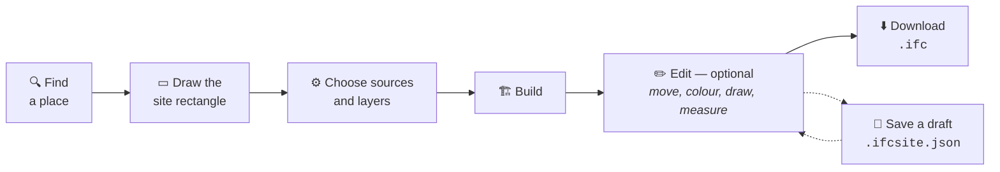

<p align="center">
  <picture>
    <source media="(prefers-color-scheme: dark)" srcset="public/logo_light.svg">
    
  </picture>
</p>

# IFC Site

**Extract and build a georeferenced IFC site context model from public cartographic datasets**

IFC Site pulls the buildings, roads, terrain and context layers under a rectangle you draw,
extrudes them into an *LOD100* massing model, lets you edit it, and writes an IFC file you can
open in Revit, ArchiCAD, Blender, BlenderBIM, Solibri or any IFC viewer.

There is no backend. No account, no API key, no upload. Every query goes straight from your
browser to a public service, and the projection, the geometry and the IFC serialisation all
run in the tab.

> Internals, module by module: **[DEVELOPER.md](DEVELOPER.md)**.

---

## Quick start

Requires **Node 20.19 or newer** (Next.js 16, and Vite for the test runner).

```bash
git clone https://github.com/isma3lMB/IfcSite.git
cd IfcSite
npm install
npm run dev
```

Open **http://localhost:3000**.

Then, in the app:

1. **Find a place** — the search opens on arrival. Type a street, a town, a postcode, or a
   `lat, lon` pair. Or just pan the map.
2. **Draw the site** — click two opposite corners, or drag. The rectangle *is* the site
   definition; nothing is selected until you draw one.
3. **Build model** — watch the status line. A first build in a French town takes a few
   seconds.
4. **Download IFC** — the file lands as `IFCSITE_<lon>_<lat>.ifc`.

Everything between steps 3 and 4 — editing, drawing extra buildings, measuring, restyling
layers — is optional.

### All the scripts

| Command | What it does |
| --- | --- |
| `npm run dev` | Dev server on `:3000`, Turbopack |
| `npm run build` | Static export → `out/` |
| `npm run start` | `npx serve out` — serve the export locally |
| `npm run typecheck` | `tsc --noEmit` |
| `npm test` | Unit tests, once |
| `npm run test:watch` | Unit tests, on change |
| `npm run epsg` | Regenerate `public/epsg.json` from the `epsg-index` package |

> **Serve the build over HTTP.** Opening `out/index.html` through `file://` gives the page a
> null origin, which Overpass rejects — and it answers with an *empty result* rather than an
> error, which is much harder to diagnose. `npm run start` does the right thing.

Testing from a phone on the same network? Add its address to `allowedDevOrigins` in
[next.config.ts](next.config.ts).

---

## What it does



The rectangle's bounds become a bbox query against OpenStreetMap or the French IGN
Géoplateforme, size the terrain grid, and clip every polygon that crosses the edge. What
comes back is projected into a real coordinate system, extruded, draped onto the ground and
written out as IFC.

All of it in the browser. `next build` emits a plain directory of HTML and JS with no server
runtime, and there are deliberately no route handlers anywhere in the app — every service it
talks to sends `Access-Control-Allow-Origin: *`, exactly as the original single-file page
did.

---

## Features

### The site

- **Draw a rectangle** on an OpenStreetMap basemap — two corner clicks, or one drag.
- Sides are held between **100 m and 2000 m** (1000 m by default). Past that, Overpass and
  the IGN WFS start refusing.
- **Place search** through Nominatim, plus four city presets that set the matching EPSG.
- **Projected CRS** chosen automatically for wherever the rectangle landed — or picked by
  hand from a searchable list of the systems actually valid there. Once you choose one, it
  is yours: nudging the rectangle will not overrule it.

### Two data providers

| | **OpenStreetMap** | **IGN Géoplateforme** |
| --- | --- | --- |
| Coverage | Worldwide | Metropolitan France |
| Buildings | OSM footprints | BD TOPO |
| Heights | `height` tag → `building:levels × 3` → your fallback | Surveyed `hauteur` on nearly every building |
| Terrain | Terrarium, ~30 m | RGE ALTI, ~1 m source |
| Extra layers | — | Vegetation, hedges, water, cadastral parcels |
| Key needed | No | No |

Individual trees are the exception: BD TOPO stops at vegetation polygons, so trees come from
OSM under **both** providers.

Every build reports which heights were surveyed or tagged and how many were estimated, so
you always know how much of the model is measured and how much is a guess.

### Layers you can include

Buildings · road surfaces · railway tracks · terrain mesh · individual trees ·
vegetation and hedges · water surfaces · cadastral parcels.

The last four are IGN-only and are dimmed under OpenStreetMap. A layer that fails is
reported and skipped on its own — context never costs you the build. Terrain is the same:
if it cannot be fetched, the build continues on a flat datum and says so.

**Terrain accuracy** is a target, not a promise — a large site runs out of point budget long
before 1 m, and the panel tells you the grid you will actually get:

| Coarse | Standard | Fine | Maximum |
| --- | --- | --- | --- |
| ~30 m cells | ~15 m cells | ~5 m cells | ~1 m cells |

### Editing what you built

- **Select and transform** any element with a gizmo — move, rotate, scale, with a
  uniform-scale lock.
- **Colour, opacity and height** per element, or **per layer** in one go, with a per-layer
  offset for lifting roads and draped surfaces off the ground.
- **Draw your own** buildings — box or polygon footprints — and **plant trees**. These are
  the one thing no rebuild can bring back, so rebuilding over them asks first.
- **Model origin**: the point the exported file calls `(0, 0, 0)`. Drag it and the file is
  re-georeferenced without anything moving on the ground.
- **Local project placement**: give that origin your project's own coordinates and turn the
  axes to its grid. It becomes the IFC site placement; the georeferencing is untouched.
- **Undo/redo**, 100 deep, one command per gesture.
- **Model layers** — every layer and element, with visibility, colour and a filter.
- **Measure** distance and area, snapping to vertices, midpoints and edges.

### Drafts

Two verbs, deliberately not synonyms:

- **Save** keeps a site in this browser (IndexedDB), listed by name, size, building count
  and when you saved it.
- **Export** writes a portable **`.ifcsite.json`** you can move, back up or hand to someone.

Either one reopens with *every* edit intact — hand-drawn footprints, transforms, colours,
layer offsets, the origin marker, the placement. None of that survives a rebuild, because
element ids come from the source data and shift between fetches. Opening a draft touches the
network not at all.

### And the rest

- **French and English** throughout, switchable live.
- **Light and dark** themes. The exported colours are identical either way — the theme
  changes the sky and the lighting, never the model.
- **Orthographic** projection toggle, and a **presentation mode** that flies a slow orbit
  with the whole site guaranteed in frame — its pace is adjustable under Advanced, and
  changing it mid-orbit changes the speed without moving the camera.

### Keyboard

| | |
| --- | --- |
| `G` / `R` / `S` | Move / rotate / scale |
| `Ctrl`+`Z` | Undo |
| `Ctrl`+`Shift`+`Z` or `Ctrl`+`Y` | Redo |
| `Del` | Delete the selection |
| `Enter` | Close a polygon footprint or an area measurement |
| `Esc` | Unwind — the open card, then a drawing gesture, then the selection |

---

## What comes out

### The IFC file

**`IFCSITE_<lon>_<lat>.ifc`** — for example `IFCSITE_2.3522_48.8566.ifc`. Longitude then
latitude, to four decimals, which is about 11 m.

In your choice of three schemas:

| | |
| --- | --- |
| **IFC2X3** | For older readers. No tessellation existed yet, so terrain, roads and trees go out as boundary representation — the same model, in a file roughly 3× the size. |
| **IFC4** | The default, and what most readers do best with. |
| **IFC4X3** | For infrastructure work. Vegetation gets a real `.VEGETATION.` predefined type. |

Switching schema **re-serialises what is already on screen** — nothing is re-fetched and no
coordinate moves.

### Georeferencing

Written to **LoGeoRef 50**: the model sits at a local origin, and the projected
easting/northing of that origin travels in `IfcMapConversion` + `IfcProjectedCRS`. Under
IFC2X3, which has neither entity, the same six numbers go out as `ePset_MapConversion`
and `ePset_ProjectedCRS` — the convention buildingSMART defines for exactly this case. The
IFC panel picks which root they hang off, since readers disagree: `IfcSite` by default,
`IfcProject`, or both.

**LoGeoRef 30** is written identically on all three schemas: `IfcSite.RefLatitude`,
`RefLongitude` and `RefElevation`, so a reader that knows nothing about map conversion still
finds the site on Earth.

The **vertical datum follows the elevation source**, not the horizontal grid — NGF-IGN69 for
RGE ALTI, EGM96 for Terrarium, and none at all if the build established no altimetry. A
projected CRS is two-dimensional and names no vertical datum; tying one to the grid would
mean claiming a national datum for heights that came out of a global mosaic.

Model coordinates themselves are purely local, measured from the origin marker: a building
on the ground exports near `z = 0` rather than carrying the site's altitude.

### Element mapping

| Scene item | IFC |
| --- | --- |
| Building | `IfcBuildingElementProxy` + `IfcExtrudedAreaSolid` over an `IfcArbitraryClosedProfileDef`; a closed `IfcPolygonalFaceSet` prism under IFC4X3 |
| Terrain, roads, railways, draped layers | `IfcGeographicElement` + `IfcPolygonalFaceSet` (a proxy under IFC2X3) |
| Tree | `IfcBuildingElementProxy`, trunk and canopy styled separately |
| Source attributes | `Pset_SiteContext` |
| Colour | `IfcStyledItem` → `IfcSurfaceStyle`, written as explicit matte |

Colours go out exactly as the preview shows them. The preview and the deliverable read the
same palette, so they cannot disagree.

A sample export is committed at
[context_48.8566_2.3522.ifc](context_48.8566_2.3522.ifc) — central Paris, IGN, IFC4.

### What it is not

This is **LOD100 massing from open data, not a survey.**

- Building heights are surveyed where the source has them and estimated where it does not.
  The build summary tells you the split every time.
- `Scale` in the map conversion is `1.0` — honest at these extents, not over several
  kilometres. Substitute the real combined grid factor if you go wider, or your model will
  disagree with the surveyor's.
- Footprint holes from OSM multipolygon relations are dropped; outer rings only.
- Vegetation canopies are flattened on purpose. Real 15–18 m canopies dominate a site model
  and hide everything behind them, so the masses become a thin ground skin that keeps the
  classes' relative ordering.

### The draft file

`<name>.ifcsite.json` — the *document*, as against the IFC *deliverable*. It reopens here
with every edit intact and opens nowhere else. Keep both: the IFC for whoever needs the
model, the draft for when you need to change it.

---

## Deploying

```bash
npm run build     # → out/
```

`out/` is a plain static directory. Put it behind any static host — GitHub Pages, Netlify,
Cloudflare Pages, S3, nginx. There is no server runtime and no environment to configure,
because there is nothing on the server side to configure.

---

## Advanced settings

Under **Advanced** in the options panel are ten settings: building and tree caps, maximum
site side, the Overpass timeout, the terrain grid ceiling, the drape step, the
storey/lane/track width defaults, and how long one presentation revolution takes. The
defaults suit almost every site. They are sliders
rather than number fields on purpose — these numbers feed fetch deadlines and geometry
loops, where a bad value is a wedged tab rather than a wrong pixel.

---

## Contributing

Issues and pull requests are welcome. Start with **[DEVELOPER.md](DEVELOPER.md)** — it
covers the architecture, the layering rules, and the reasoning behind the parts that look
strange on purpose.

Before opening a PR:

```bash
npm run typecheck
npm test
npm run build
```

All three run automatically on every pull request. **[CONTRIBUTING.md](CONTRIBUTING.md)** has the
rest: the layering rule that keeps the logic testable, where the tests live, and how to run one
file.

---

## Licence and credits

**[GPL-3.0](LICENSE)**

Built on public data and free services. If you use this, respect their terms and keep the
requests light:

- **[OpenStreetMap](https://www.openstreetmap.org/copyright)** contributors — buildings,
  roads and trees, under ODbL. Queried through the [Overpass API](https://overpass-api.de/).
  The 2D map's basemap tiles come from the same project, served by
  [tile.openstreetmap.org](https://tile.openstreetmap.org/).
- **[IGN Géoplateforme](https://geoservices.ign.fr/)** — BD TOPO, RGE ALTI and the French
  cadastre.
- **[Nominatim](https://nominatim.org/)** — place search.
- **[AWS Terrain Tiles](https://registry.opendata.aws/terrain-tiles/)** — worldwide
  elevation.

Source: **https://github.com/isma3lMB/IfcSite**
